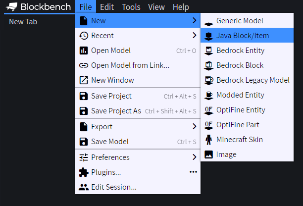
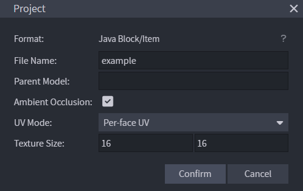
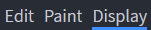
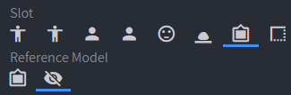
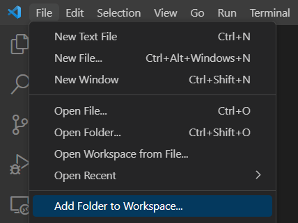
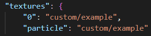
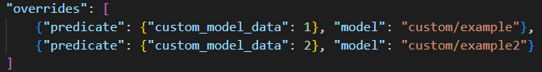
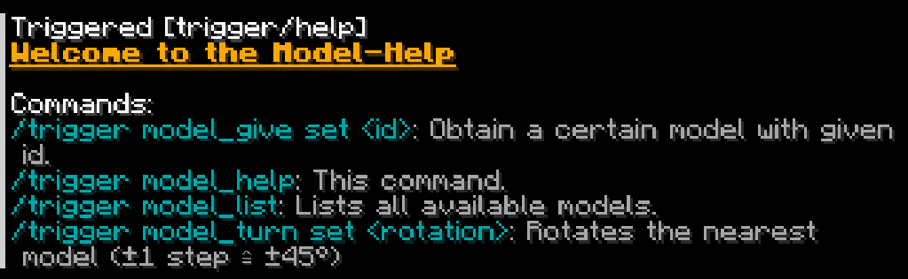
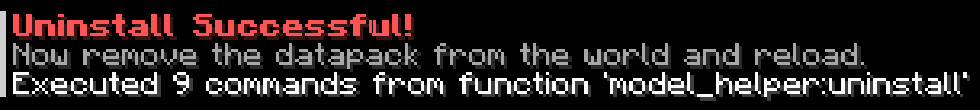

# Model-Helper for Minecraft: Java Edition [1.19.3]

GitHub/Source: https://github.com/pigupp/model-helper-mc  
Minecraft: https://www.minecraft.net/store/minecraft-java-bedrock-edition-pc  

## Description:
Model-Helper is a tool that makes it easier to implement custom models (objects) in Minecraft.  
It consists of a datapack (tools) and a resourcepack (models & textures) that work closely together.  
(FYI: Models don't have hitboxes unless you add your own)  

## Software:
To create and edit the models, I recommend [Blockbench][blockbench].  
And to edit the files inside Model-Helper (datapack & resourcepack) I recommend [Visual Studio Code][vscode].  
(⇒ but of course any text editor will do)  

## Instructions:

---

### I. Installation / Preparation:

1. Extract/Unzip both zip-files included in this package.
2. Move "Model-Helper Datapack" into the `datapacks`-folder of your Minecraft world [(Help)][tutorial_datapack].
3. Move "Model-Helper Resourcepack" into your `resourcepacks`-folder [(Help)][tutorial_resourcepack].

---

### II. Building the models using Blockbench:

1. Create a new "Java Block/Item" (Remember to follow the naming rules described in III/2).
    New > Java Block/Item]" style="width:40%;"> 
2. Edit and paint your model [(Help)][tutorial_blockbench].
3. Now switch to the "Display" tab, for "Slot" click on "Frame" and for "Reference Model" click on "Item Frame (invisible)".  
     
   
4. The (invisible) item frame will be the "floor"/bottom of your model, so you need to rotate the whole model by X = -90 ("Rotation").
5. Now adjust the distance ("Translation" ⇒ Z-Axis) between the bottom of your model and the reference cube (e.g. Z = -16).
6. If you want, you can also change the scale of the model; just try the different settings until it looks nice (or not).
7. Now go to `[File > Save Model]` and save it somewhere (e.g. `C:\Users\<USER>\3D Objects\Blockbench\`).

---

### III. Adding Models and Textures:

1. Open both folders (VSC: [File > Add Folder to Workspace...]; Or just open them in a file explorer).  
    Add Folder to Workspace...]" style="width:35%;">
2. Navigate to the folder: `Model-Helper Resourcepack`:
   - **Important**: All names within the resourcepack must be in **lower case** and **not include any special characters** (only `a-z`, `0-9`, `-_`; e.g. `test-model_5`)
   1. Move your model file (`<name>.json`) to `\assets\minecraft\models\custom\`
   2. Open your model file with a text editor (VS Code) and change the values of `"0"` and `"particle"` to `"custom/<name>"` (replace `<name>` with the name of your model)  
      
   3. Move your texture file for your model (`<name>.png`) to `\assets\minecraft\textures\custom\`
   - Now open `\assets\minecraft\models\item\paper.json`
   4. Under "overrides" write `{"predicate": {"custom_model_data": <ID>}, "model": "custom/<name>"}`, replace `<ID>` with a unique positive integer (⇒ CustomModelData-ID), replace `<name>` with the name of your model and don't forget to put a comma next to the above line.  
       Add Folder to Workspace...]" style="width:70%;">
3. Navigate to the folder: "Model-Helper Datapack":
   - All names within the datapack, unlike the resourcepack, can be uppercase and contain special characters (e.g. `Wêird Mödel`).
   1. Open `\data\model_config\functions\items.mcfunction` and duplicate the command according to the instructions in the file (marked with #)
   2. Open `\data\model_config\functions\text.mcfunction` and duplicate the command according to the instructions in the file (marked with #)
4. Finally, reload the datapack by typing "/reload" in the chat and the resourcepack by pressing `[F3] + [T]`.

---

### IV. Using commands and tools:

- Type `/trigger model_help` in the Minecraft chat `[T]` and press Enter to see all available commands.
   
- To obtain added models, use `/trigger model_list` and click on the name of the item you want.
- The rotation tool can be acquired with `/trigger model_give set -1` or via the model-list.
- The model closest to you will be rotated when using the rotation tool or `/trigger model_turn set <value=[-8;8]>`  
   ⇒ See the item description for more details.

---

### V. Uninstalling/Removing Model-Helper:

#### Datapack:
   1. Execute `/function model_helper:uninstall` to remove all scoreboards that were created by this datapack.
      
   2. Delete the datapack from the `datapacks`-folder.
   3. Execute `/reload` and the datapack should be gone from your world or server.

#### Resourcepack:
   1. Delete the resourcepack from your `resourcepacks`-folder.
   2. You will need to reload your resources if you are currently playing by pressing `[F3] + [T]`.

---

### VI. Updating Model-Helper:

1. Uninstall/Remove Model-Helper (⇒ step V) but before reloading everything, move the updated folders into their directories (⇒ step I).
2. Now reload the datapack and resourcepack (`/reload` & `[F3] + [T]`).

---

 *You've made it!*

<!-- URLs -->
[blockbench]: https://www.blockbench.net/
[vscode]: https://code.visualstudio.com/
[tutorial_datapack]: https://minecraft.fandom.com/wiki/Tutorials/Installing_a_data_pack
[tutorial_resourcepack]: https://minecraft.fandom.com/wiki/Tutorials/Loading_a_resource_pack
[tutorial_blockbench]: https://www.google.com/search?q=How+to+use+Blockbench

